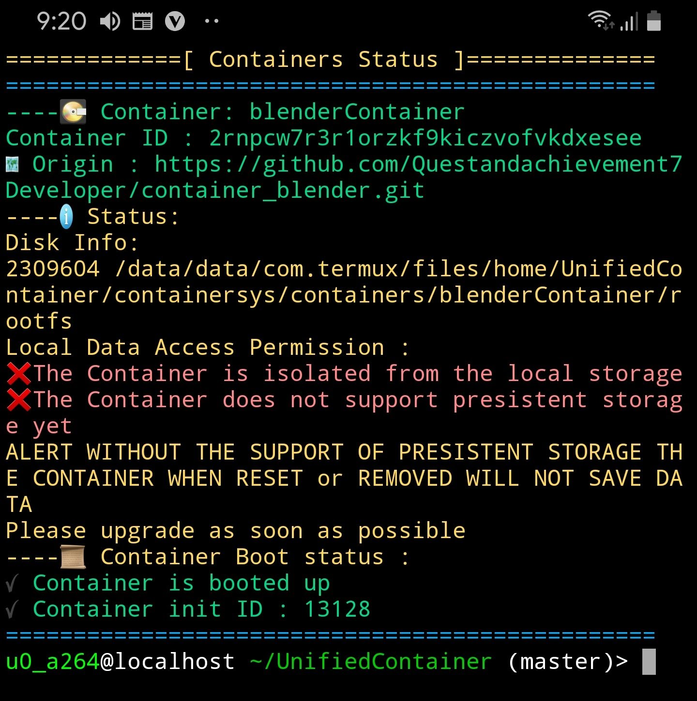
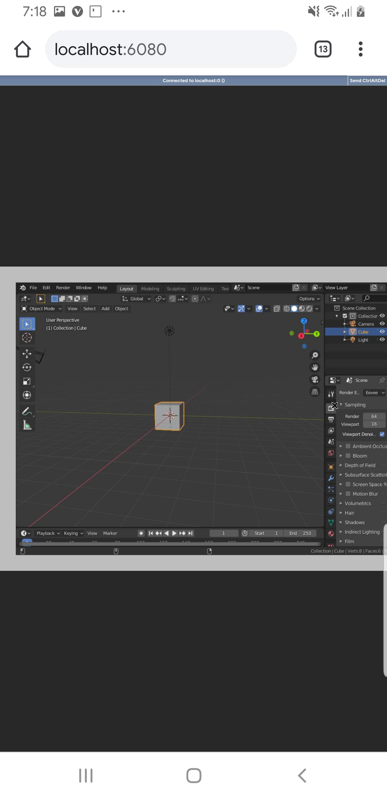

# Warning UnifiedContainer is undergoing massive rebuild please wait for the release package


[](https://gitpod.io/#https://github.com/Questandachievement7Developer/UnifiedContainer) 
[](https://discord.gg/krVd2b9)

# :computer: Unified Container :computer: 

> Project Bay or also known as Unified Container is a linux container manager Userspace proot backend that allows to create and share linux container in ease without any difficulty on creating one, Inspired from these programs <br>
[TermuxArch](https://github.com/SDRausty/TermuxArch) <br>
[MFDGaming Ubuntu](https://github.com/MFDGaming/ubuntu-in-termux) <br>
[Neo Oli Ubuntu](https://github.com/Neo-Oli/termux-ubuntu) <br>
[Multipass](https://github.com/canonical/multipass) <br>
[Docker](https://github.com/docker) <br>
## :white_check_mark: What its use and its advantages ?
1. It can be used for anything really build a desktop, do a portable sharable reasearch container etc
2. Its architechture is simple yet effective so system delivery is more efficient
3. Have less dependencies on daemons due to the nature of simplistic architechture
4. Faster error troubleshooting since you can simply flick reset switch for every container
5. Structured Workflow
##  :question: Where can it be installed?
### :gear: PTrace Capable Kernel machines
1. Termux ( Currently Testing )
2. Ubuntu
3. Debian
4. Archlinux
5. Manjaro
6. CentOS
7. WSL2 Distro

### :gear: NON PTRACE Machines
1. WSL1 Distro (Untested) 
2. iSH ( iOS shell ) ( Currently Testing )

### :camera: Tech demo screenshot
> Using blender Container





## :floppy_disk: How to install
```
1. Download from the Releases for the program/binary
2. $ ./UnifiedContainer_(thebuildnumber)
3. Done
Note : Next time if you want to launch you can do
$ ./launcher

```

## :battery: How to Get started
```
add Container $ ./launcher add <container name>
launchContainerService $ ./launcher launch <container name>
Import container $ ./launcher import "<git repo link>"
enter the container shell $ ./launcher shell <container name>

for further help do $ ./launcher help
```

## :heartpulse: How to share Container configuration?
For container configuration check this refrence
you can clone it and modify to get started quickly
| Container | Link | 
| ------- | ------ | 
|   importTest    |    :computer: [Repo container](https://github.com/Questandachievement7Developer/container_importExample)     |
| matrixcontainer | :computer: [Repo Container](https://github.com/Questandachievement7Developer/container_matrix)|
| empiresserver | :computer: [Repo Container](https://github.com/Questandachievement7Developer/containers_EmpiresandAllies) |

## :clipboard: Tested Systems

| Device | Status | 
| ------- | ------ | 
| ASUS X505ZA WSL2 Ubuntu | Runs Well with no Problem | 
| Pixel 4 Android Emulator Android 9 Playstore Termux | Testing |
| Apple iPhone XS iSH | Testing |
| Lenovo 81N4 WSL2 Ubuntu | Testing |
| Pixel 5 Android Emulator Android 7 Playstore Termux | Testing |
| Bluestacks Termux | Testing | 


## Feels confused about the installation setup or anything wanted to implemented in this version?
Feel free to contact to these: <br>
:email: questandachievement@gmail.com  <br>
Personal Discord Yuuta kun#5097 <br>
Our community discord [Discord group](https://discord.gg/krVd2b9)
> Don't hestitate to ask we will help you and we won't kill you if you ask so many questions xd
